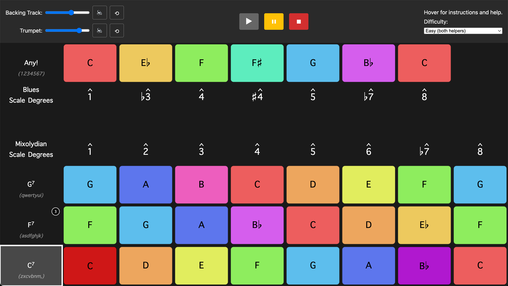

# Color Improv

_A screenshot showing that C7 is the current chord playing in the backing track, the user playing a C and B♭ via the "z" and "m" keys from the bottom row of the keyboard, corresponding to the C Mixolydian scale to be played over the C7 chord, and an indication that the F7 chord is coming in three beats.
Note the visuals indicating that the keys for the C and B♭ are pressed (compare with other unpressed C's and B♭'s in other rows)._

## Overall project
Color Improv is an interactive music education web app that teaches how to improvise on the 12-bar blues through colorful scales, turning one's device into a musical instrument. Users get a feel for the feel and timing of the 12-bar blues by playing trumpet samples over a backing track.

## How to play
Each row of the visual grid is mapped to a row of the keyboard. When the chords change, adjust the scale you're playing by moving your fingers to the corresponding row of the keyboard. Otherwise, the number row sounds good at any time!

## A few more details...
The backing track is playing a 12-bar blues in C, featuring the three primary dominant-seventh chords, C7, F7, and G7 (or I7, IV7, and V7).  The basic progression is: 4 bars of C7; 2 bars of F7, then back to 2 bars of C7; 1 bar of G7, F7, C7, then G7 to lead back to the next 12-bar phrase starting on C7.
A simple way to improvise/solo over these chords is to use notes from the mixolydian scale (a major scale with a lowered 7th scale degree) of the same root: i.e. C Mixolydian over C7, F Mixolydian over F7, G Mixolydian over G7. Alternatively, the notes of the tonic blues scale work well over any of the chords.

## Built with:
- Vanilla ES6+ modules
- Web Audio API
- Canvas API
- Vite

## Future features:
- Ability to record, download, save
- Adjust difficulty level via visual assistance
- Leaderboard of best improvs
- Handle latency
- Host
