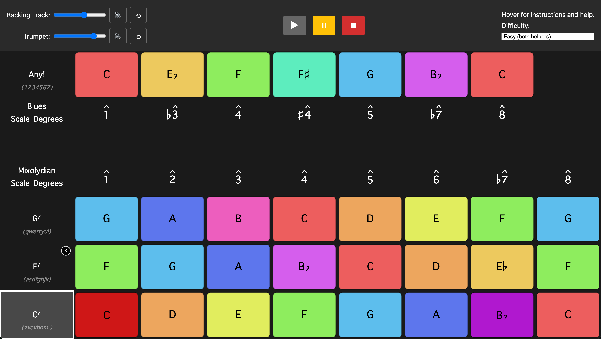

# Color Improv

_A screenshot showing that C7 is the current chord playing in the backing track, the user playing a C and Bb via the "z" and "m" keys from the bottom row of the keyboard, corresponding to the C Mixolydian scale to be played over the C7 chord, and an indication that the F7 chord is coming in two beats.
Note the visuals indicating that the keys for the C and Bb are pressed (compare with other unpressed C's and Bb's in other rows)._

## Overview
Color Improv is an interactive music education web app that teaches how to improvise on the 12-bar blues through colorful scales, turning one's device into a musical instrument. Users get a feel for the feel and timing of the 12-bar blues by playing trumpet samples over a backing track.

## Features
- Keyboard-to-note mapping that turns your laptop keyboard into a musical instrument
- Real-time visual grid showing active notes, current harmony, upcoming chord changes; configurable by difficulty level
- Recording support with downloadable audio recording and MIDI event logs
- Local volume and difficulty preferences persistence, plus account-based preference sync when signed in
- Authentication flow for saving user settings across sessions

## How to Play
Each row of the visual grid is mapped to a row of the keyboard. When the chords change, adjust the scale you're playing by moving your fingers to the corresponding row of the keyboard. Otherwise, the number row sounds good at any time!

## Music Theory
The backing track is playing a 12-bar blues in C, featuring the three primary dominant-seventh chords, C7, F7, and G7 (or I7, IV7, and V7).  The basic progression is: 4 bars of C7; 2 bars of F7, then back to 2 bars of C7; 1 bar of G7, F7, C7, then G7 to lead back to the next 12-bar phrase starting on C7.
A simple way to improvise/solo over these chords is to use notes from the mixolydian scale (a major scale with a lowered 7th scale degree) of the same root: i.e. C Mixolydian over C7, F Mixolydian over F7, G Mixolydian over G7. Alternatively, the notes of the tonic blues scale work well over any of the chords.

## Built With
- Vanilla JavaScript with ES modules
- Vite
- Express
- Prisma + PostgreSQL
- Web Audio API
- Canvas API

## Roadmap
- Ability to save recordings to account
- Upload custom backing tracks
- Musical analysis of backing track and improvisation

## Development Process
This solo project was built as a hands-on learning experience of full-stack architecture, modern JavaScript development, and good practices after an extended time away from coding, using an old [hack-a-thon project]([url](https://github.com/dylanmor123/ColorImproviser)) as the starting point. AI tools (Claude, GitHub Copilot) largely played the role as a senior dev who pair-programmed with me in early stages, then gradually moved to just reviewing pull requests. Tests were largely AI-generated. All architectural decisions were finalized by me, pushing back on AI suggestions until they met the project's needs.
